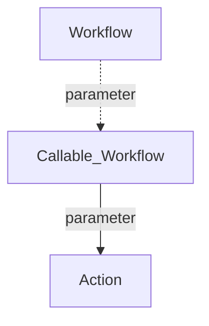

<div id="top" align="center">
<h1>GH-Pages with modified Jeckyll theme Minima</h1>

<p>Jeckyll theme Minima with automatic Javascript Breadcrumbs</p>

[Report Issue](https://github.com/Zheng-Bote/gha-gh-pages_minima/issues) [Request Feature](https://github.com/Zheng-Bote/gha-gh-pages_minima/pulls)

[](https://choosealicense.com/licenses/mit/)


</div>

<hr>

<!-- START doctoc generated TOC please keep comment here to allow auto update -->
<!-- DON'T EDIT THIS SECTION, INSTEAD RE-RUN doctoc TO UPDATE -->
**Table of Contents**

- [Description](#description)
- [Features](#features)
  - [automated Markdown indexing](#automated-markdown-indexing)
  - [automated Table of Contents (ToC)](#automated-table-of-contents-toc)
  - [Jeckyll](#jeckyll)
  - [Jeckyll Minima theme](#jeckyll-minima-theme)
- [Status](#status)
- [Installation](#installation)
  - [Dependencies](#dependencies)
  - [folder structure](#folder-structure)
- [Usage/Examples](#usageexamples)
- [API Reference](#api-reference)
  - [Parameters](#parameters)
- [Documentation](#documentation)
  - [Github Page](#github-page)
- [Screenshots](#screenshots)
- [Authors and License](#authors-and-license)
  - [License](#license)
    - [MIT](#mit)
  - [Authors](#authors)
- [Code Contributors](#code-contributors)

<!-- END doctoc generated TOC please keep comment here to allow auto update -->

<hr>

> \[!NOTE]
> This README is still under constrcution and incomplete.

> \[!TIP]
> see branch _gh-pages_ as well as the content of `.github/workflows`.

## Description

Jeckyll theme Minima with automatic Javascript Breadcrumbs, Auto-TOC and Auto-Indexing


## Features

- \[x] works as designed
- \[ ] no bugs
- \[x] Github Action for automated markdown indexing
- \[x] Github Action for automated TOC
- \[x] automated Breadcrumbs in GH-Pages

### automated Markdown indexing

 `.github/workflows/ghp-markdown_index.yml`

**Create / Update markdown indexes for GH Pages**

Github Marketplace [Markdown action: create indexes](https://github.com/marketplace/actions/markdown-action-create-indexes)

### automated Table of Contents (ToC)


 `.github/workflows/repo-create_doctoc.yml`

**Create / Update Table of Contents**

This is a GitHub Actions to generate TOC (Table of Contents), which executes DocToc and commits if changed.

[gha-toc-generator](https://github.com/Zheng-Bote/gha-toc-generator)
(_fork from [technote-space](https://github.com/technote-space/toc-generator)_)

### Jeckyll

Jekyll is a blog-aware, site generator written in Ruby. It takes raw text files, runs it through a renderer and produces a publishable static website. **Perfect for Github Pages.**

[Jeckyll](https://jekyllrb.com/docs/themes/) has an extensive theme system that allows you to leverage community-maintained templates and styles to customize your site’s presentation. Jekyll themes specify plugins and package up assets, layouts, includes, and stylesheets in a way that can be overridden by your site’s content.

### Jeckyll Minima theme

[Minima v3](https://github.com/jekyll/minima) It's Jekyll's default (and first) theme. It's what you get when you run jekyll new.

<p align="right">(<a href="#top">back to top</a>)</p>

## Status


[](https://github.com/Zheng-Bote/gha-gh-pages_minima/actions/workflows/repo-create_tree_readme.yml)
[](https://github.com/Zheng-Bote/gha-gh-pages_minima/actions/workflows/repo-actions_docu.yml)
[](https://github.com/Zheng-Bote/gha-gh-pages_minima/actions/workflows/repo-create_doctoc.yml)

[](https://github.com/Zheng-Bote/gha-gh-pages_minima/actions/workflows/ghp-markdown_index.yml)
[GH-Page](https://zheng-bote.github.io/gha-gh-pages_minima/)

<p align="right">(<a href="#top">back to top</a>)</p>

## Installation

bla bla

### Dependencies

bla bla

### folder structure

<!-- readme-tree start -->

```
.
├── .github
│   └── workflows
│       ├── ghp-markdown_index.yml
│       ├── repo-actions_docu.yml
│       ├── repo-create_doctoc.yml
│       └── repo-create_tree_readme.yml
├── README.md
├── docs
│   └── img
│       └── screenshot_minima.png
└── tree.bak

4 directories, 7 files
```

<!-- readme-tree end -->

<p align="right">(<a href="#top">back to top</a>)</p>

## Usage/Examples

```html
<mark> under constrcution </mark>
```

<p align="right">(<a href="#top">back to top</a>)</p>

## API Reference

### Parameters

<!-- only for actions repo -->

<!-- ## Inputs -->

<!-- ## Outputs -->

        <rz-footer></rz-footer>

<!---->

| Parameter    | Type     | Description                          |
| :----------- | :------- | :----------------------------------- |
| `name`       | `string` | _Optional_ name-of-copyright-holder  |
| `created`    | `string` | _Optional_ <YYYY>                    |
| `version`    | `string` | _Optional_ \<v0.0.0>                 |
| `link_left`  | `string` | _Optional_ link-to-contact-page      |
| `link_right` | `string` | _Optional_ link-to-legal-notice-page |

<p align="right">(<a href="#top">back to top</a>)</p>

## Documentation



### Github Page

[](https://www.github.com/Zheng-Bote)

see also: <https://linktodocumentation>

> \[!NOTE]
> Useful information that users should know, even when skimming content.

> \[!TIP]
> Helpful advice for doing things better or more easily.

> \[!IMPORTANT]
> Key information users need to know to achieve their goal.

> \[!WARNING]
> Urgent info that needs immediate user attention to avoid problems.

> \[!CAUTION]
> Advises about risks or negative outcomes of certain actions.

<p align="right">(<a href="#top">back to top</a>)</p>

## Screenshots


<p align="right">(<a href="#top">back to top</a>)</p>

## Authors and License

### License

#### MIT

MIT License

Copyright (c) 2024 Zheng Robert

Permission is hereby granted, free of charge, to any person obtaining a copy
of this software and associated documentation files (the "Software"), to deal
in the Software without restriction, including without limitation the rights
to use, copy, modify, merge, publish, distribute, sublicense, and/or sell
copies of the Software, and to permit persons to whom the Software is
furnished to do so, subject to the following conditions:

The above copyright notice and this permission notice shall be included in all
copies or substantial portions of the Software.

THE SOFTWARE IS PROVIDED "AS IS", WITHOUT WARRANTY OF ANY KIND, EXPRESS OR
IMPLIED, INCLUDING BUT NOT LIMITED TO THE WARRANTIES OF MERCHANTABILITY,
FITNESS FOR A PARTICULAR PURPOSE AND NONINFRINGEMENT. IN NO EVENT SHALL THE
AUTHORS OR COPYRIGHT HOLDERS BE LIABLE FOR ANY CLAIM, DAMAGES OR OTHER
LIABILITY, WHETHER IN AN ACTION OF CONTRACT, TORT OR OTHERWISE, ARISING FROM,
OUT OF OR IN CONNECTION WITH THE SOFTWARE OR THE USE OR OTHER DEALINGS IN THE
SOFTWARE.

        https://choosealicense.com/licenses/mit/

### Authors

- [](https://www.github.com/Zheng-Bote)

## Code Contributors


[](https://www.github.com/Zheng-Bote)

<hr>

:vulcan_salute:

<p align="right">(<a href="#top">back to top</a>)</p>
