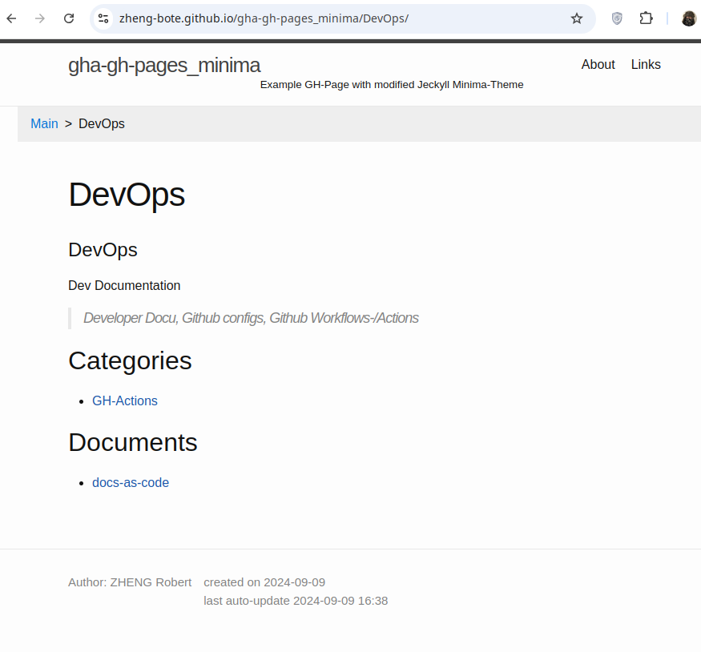
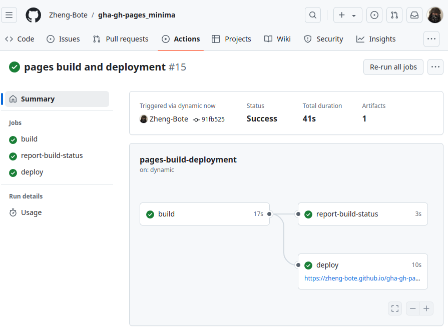

<div id="top" align="center">
<h1>GH-Pages with modified Jeckyll theme Minima</h1>

<p>Jeckyll theme Minima with automatic Javascript Breadcrumbs</p>

[Report Issue](https://github.com/Zheng-Bote/gha-gh-pages_minima/issues) [Request Feature](https://github.com/Zheng-Bote/gha-gh-pages_minima/pulls)

[](https://choosealicense.com/licenses/mit/)


</div>

<hr>

<!-- START doctoc generated TOC please keep comment here to allow auto update -->
<!-- DON'T EDIT THIS SECTION, INSTEAD RE-RUN doctoc TO UPDATE -->
**Table of Contents**

- [Description](#description)
- [Features](#features)
  - [automated Markdown indexing](#automated-markdown-indexing)
  - [automated Table of Contents (ToC)](#automated-table-of-contents-toc)
  - [Jeckyll](#jeckyll)
  - [Jeckyll Minima theme](#jeckyll-minima-theme)
  - [automated Breadcrumbs in GH-Pages](#automated-breadcrumbs-in-gh-pages)
- [Status](#status)
- [Installation](#installation)
  - [Github repo settings](#github-repo-settings)
    - [Create a branch `gh-pages`](#create-a-branch-gh-pages)
    - [configure GH-Pages in Settings](#configure-gh-pages-in-settings)
- [Configuration](#configuration)
  - [Configuration of Jeckyll theme Minima](#configuration-of-jeckyll-theme-minima)
- [GH-Page content (folders and pages)](#gh-page-content-folders-and-pages)
- [Dependencies](#dependencies)
  - [automated Markdown indexing](#automated-markdown-indexing-1)
  - [automated Table of Contents (ToC)](#automated-table-of-contents-toc-1)
  - [Jeckyll](#jeckyll-1)
  - [Jeckyll Minima theme](#jeckyll-minima-theme-1)
  - [Breadcrumbs in Minima GH-Pages](#breadcrumbs-in-minima-gh-pages)
  - [folder structure](#folder-structure)
- [Documentation](#documentation)
  - [Github Page](#github-page)
- [Screenshots](#screenshots)
  - [Settings - Pages](#settings---pages)
  - [Jeckyll theme Minima (modified)](#jeckyll-theme-minima-modified)
  - [Minima Breadcrumbs](#minima-breadcrumbs)
    - [Breadcrumbs folder-level](#breadcrumbs-folder-level)
    - [Breadcrumbs page-level](#breadcrumbs-page-level)
  - [Github Actions / Workflows](#github-actions--workflows)
- [Authors and License](#authors-and-license)
  - [License](#license)
  - [Authors](#authors)
- [Code Contributors](#code-contributors)

<!-- END doctoc generated TOC please keep comment here to allow auto update -->

<hr>

## Description

Jeckyll theme Minima with automatic Javascript Breadcrumbs, Auto-TOC and Auto-Indexing



## Features

- \[x] works as designed
- \[ ] no bugs
- \[x] Github Action for automated markdown indexing
- \[x] Github Action for automated TOC
- \[x] automated Breadcrumbs in GH-Pages

### automated Markdown indexing

 `.github/workflows/ghp-markdown_index.yml`

**Create / Update markdown indexes for GH Pages**

Github Marketplace [Markdown action: create indexes](https://github.com/marketplace/actions/markdown-action-create-indexes)

### automated Table of Contents (ToC)


 `.github/workflows/repo-create_doctoc.yml`

**Create / Update Table of Contents**

This is a GitHub Actions to generate TOC (Table of Contents), which executes DocToc and commits if changed.

[gha-toc-generator](https://github.com/Zheng-Bote/gha-toc-generator)
(_fork from [technote-space](https://github.com/technote-space/toc-generator)_)

### Jeckyll

Jekyll is a blog-aware, site generator written in Ruby. It takes raw text files, runs it through a renderer and produces a publishable static website. **Perfect for Github Pages.**

[Jeckyll](https://jekyllrb.com/docs/themes/) has an extensive theme system that allows you to leverage community-maintained templates and styles to customize your site’s presentation. Jekyll themes specify plugins and package up assets, layouts, includes, and stylesheets in a way that can be overridden by your site’s content.

### Jeckyll Minima theme

[Minima v3](https://github.com/jekyll/minima) It's Jekyll's default (and first) theme. It's what you get when you run jekyll new.

### automated Breadcrumbs in GH-Pages

easy to use _Javascript function_, documentation comming soon.

<p align="right">(<a href="#top">back to top</a>)</p>

## Status


[](https://github.com/Zheng-Bote/gha-gh-pages_minima/actions/workflows/repo-create_tree_readme.yml)
[](https://github.com/Zheng-Bote/gha-gh-pages_minima/actions/workflows/repo-actions_docu.yml)
[](https://github.com/Zheng-Bote/gha-gh-pages_minima/actions/workflows/repo-create_doctoc.yml)

[](https://github.com/Zheng-Bote/gha-gh-pages_minima/actions/workflows/ghp-markdown_index.yml)
[GH-Page](https://zheng-bote.github.io/gha-gh-pages_minima/)

<p align="right">(<a href="#top">back to top</a>)</p>

## Installation

> \[!TIP]
> see branch _gh-pages_ as well as the content of `.github/workflows`.

### Github repo settings

#### Create a branch `gh-pages`

- via Github UI

  or

- command line

```bash
git branch gh-pages
git push -all
```

#### configure GH-Pages in Settings

- Source `Deploy from a branch`
- Branch `gh-pages`
- folder `docs`

> \[!TIP]
> Content modifications on Branch _gh-pages_ will be automatically deployed from Github to gh-pages.
> Automatical deployment via Github works only on branch `gh-pages`


## Configuration

Clone the repo and checkout branch `gh-pages`

```bash
git clone git@github.com:Zheng-Bote/gha-gh-pages_minima.git
git checkout gh-pages
```

### Configuration of Jeckyll theme Minima

In branch `gh-pages` in folder `docs` configure / customize file `_config.yml`. For details see [Minima v3](https://github.com/jekyll/minima)

## GH-Page content (folders and pages)

Create folder structure within folder `docs` and add one or more markdown files.

> \[!WARNING]
> Don't name your markdown files `README.md`.
> Filename `README.md` is reserved for GH-Action automatic markdown indexing

Push your modification in branch `gh-pages` back to your central Github respository

> \[!NOTE]
> If your GH-Pages in `Settings` configured for branch `gh-pages`, Github will deploy your pages automatically.
> Otherwise you have to handle your GH-PAges deployment yourself

After content mdoifations and push back to your central GH repo, wait some time so the GH Actions can do their jobs.

## Dependencies

### automated Markdown indexing

 `.github/workflows/ghp-markdown_index.yml`

**Create / Update markdown indexes for GH Pages**

Github Marketplace [Markdown action: create indexes](https://github.com/marketplace/actions/markdown-action-create-indexes)

### automated Table of Contents (ToC)


 `.github/workflows/repo-create_doctoc.yml`

**Create / Update Table of Contents**

This is a GitHub Actions to generate TOC (Table of Contents), which executes DocToc and commits if changed.

[gha-toc-generator](https://github.com/Zheng-Bote/gha-toc-generator)
(_fork from [technote-space](https://github.com/technote-space/toc-generator)_)

### Jeckyll

Jekyll is a blog-aware, site generator written in Ruby. It takes raw text files, runs it through a renderer and produces a publishable static website. **Perfect for Github Pages.**

[Jeckyll](https://jekyllrb.com/docs/themes/) has an extensive theme system that allows you to leverage community-maintained templates and styles to customize your site’s presentation. Jekyll themes specify plugins and package up assets, layouts, includes, and stylesheets in a way that can be overridden by your site’s content.

### Jeckyll Minima theme

[Minima v3](https://github.com/jekyll/minima) It's Jekyll's default (and first) theme. It's what you get when you run jekyll new.

### Breadcrumbs in Minima GH-Pages

> \[!NOTE]
> There is currently (2024-09) a bug in the Minima v3 theme so custom header content is not correctly parsed [Minima v3 issues](https://github.com/jekyll/minima/issues).
> Due to this bug, the Breadcrumb function is integrated within `docs/_includes/header.html`

```css
<style>
    ul.breadcrumb {
        padding: 10px 16px;
        list-style: none;
        background-color: #eee;
    }

    ul.breadcrumb li {
        display: inline;
        font-size: 1rem;
    }

    ul.breadcrumb li+li:before {
        padding: 8px;
        color: black;
        content: ">";
    }

    ul.breadcrumb li a {
        color: #0275d8;
        text-decoration: none;
    }

    ul.breadcrumb li a:hover {
        color: #01447e;
        text-decoration: underline;
    }
</style>
```

```javascript
<script>
window.onload = start;

function start() {
  const url = window.location;
  const origin = "{{ site.page_url }}/";
  const path = url.pathname;
  let a_arr = path.split("/");
  let html = "false";

  const arr = a_arr.filter(rmEmpty);

  if (path.endsWith(".html")) {
    arr.length = arr.length - 1;
  }

  const bread = document.getElementById("bread");

  bread.innerHTML = `<li><a href="${origin}">Main</a>`;

  if (a_arr.length === 0) {
    return;
  }

  const uri_arr = [];
  for (let i = 1; i < arr.length; i++) {
    uri_arr.push(arr[i]);
    let text = origin;
    text += uri_arr.join("/");

    if (i === arr.length - 1) {
      if (path.endsWith(".html")) {
        bread.innerHTML += `<li><a href="${text}">${arr[i]}</a></li>`;
      } else {
        bread.innerHTML += `<li>${arr[i]}</li>`;
      }
    } else {
      bread.innerHTML += `<li><a href="${text}">${arr[i]}</a></li>`;
    }
  }

  function rmEmpty(item) {
    if (item.length > 0) {
      return item;
    }
  }
}

</script>
```

### folder structure

<!-- readme-tree start -->
```
.
├── .github
│   └── workflows
│       ├── ghp-markdown_index.yml
│       ├── repo-actions_docu.yml
│       ├── repo-create_doctoc.yml
│       └── repo-create_tree_readme.yml
├── README.md
├── docs
│   └── img
│       ├── screenshot_breadcrumbs_1.png
│       ├── screenshot_breadcrumbs_2.png
│       ├── screenshot_deployment.png
│       ├── screenshot_folder-structure.png
│       ├── screenshot_jeckyll_minima.png
│       ├── screenshot_markdown-indexes.png
│       ├── screenshot_minima.png
│       ├── screenshot_settings_pages.png
│       └── screenshot_toc.png
└── tree.bak

4 directories, 15 files
```
<!-- readme-tree end -->

<p align="right">(<a href="#top">back to top</a>)</p>

## Documentation


### Github Page

[](https://zheng-bote.github.io/gha-gh-pages_minima/)
https://zheng-bote.github.io/gha-gh-pages_minima/

see also: <https://www.github.com/Zheng-Bote/gha-gh-pages_minima>

<p align="right">(<a href="#top">back to top</a>)</p>

## Screenshots

### Settings - Pages


### Jeckyll theme Minima (modified)


### Minima Breadcrumbs

#### Breadcrumbs folder-level


#### Breadcrumbs page-level


### Github Actions / Workflows




<p align="right">(<a href="#top">back to top</a>)</p>

## Authors and License

### License

**MIT License**

Copyright (c) 2024 Zheng Robert

Permission is hereby granted, free of charge, to any person obtaining a copy
of this software and associated documentation files (the "Software"), to deal
in the Software without restriction, including without limitation the rights
to use, copy, modify, merge, publish, distribute, sublicense, and/or sell
copies of the Software, and to permit persons to whom the Software is
furnished to do so, subject to the following conditions:

The above copyright notice and this permission notice shall be included in all
copies or substantial portions of the Software.

THE SOFTWARE IS PROVIDED "AS IS", WITHOUT WARRANTY OF ANY KIND, EXPRESS OR
IMPLIED, INCLUDING BUT NOT LIMITED TO THE WARRANTIES OF MERCHANTABILITY,
FITNESS FOR A PARTICULAR PURPOSE AND NONINFRINGEMENT. IN NO EVENT SHALL THE
AUTHORS OR COPYRIGHT HOLDERS BE LIABLE FOR ANY CLAIM, DAMAGES OR OTHER
LIABILITY, WHETHER IN AN ACTION OF CONTRACT, TORT OR OTHERWISE, ARISING FROM,
OUT OF OR IN CONNECTION WITH THE SOFTWARE OR THE USE OR OTHER DEALINGS IN THE
SOFTWARE.

        https://choosealicense.com/licenses/mit/

### Authors

- [](https://www.github.com/Zheng-Bote)

## Code Contributors


[](https://www.github.com/Zheng-Bote)

<hr>

:vulcan_salute:

<p align="right">(<a href="#top">back to top</a>)</p>
